# VOLUME - CLIMBING CENTRE
 
### Code Institute Milestone project 1 HTML/CSS - User-Centric Frontend Development
 

    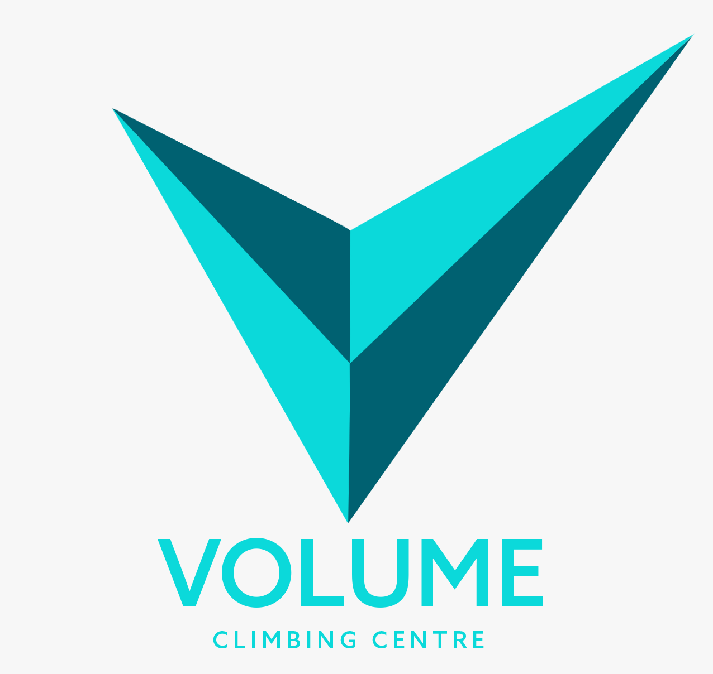
    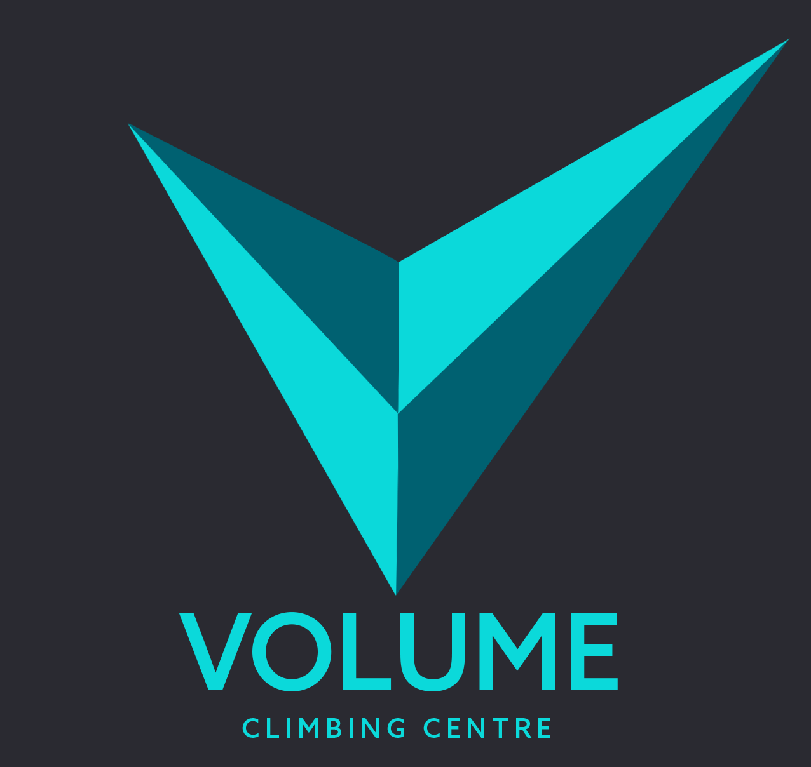

 
## About us
 
Volume is a state of the art climbing centre recently opened in the centre of Birmingham. The centre boasts hundreds of routes for both bouldering and lead climbing and offers expert training courses for climbers of all skill levels. They hope to promote themselves as a fun, community driven place where people can come together over a mutual love of climbing. 
 
This website is designed to inform users about the centre and it's available facilities, educate people who are new to the sport of climbing and act as a social media hub and booking service for its users.  
 
[Volume Climbing Centre - Live site view](https://chronologic12.github.io/volume-climbing/) 
 

    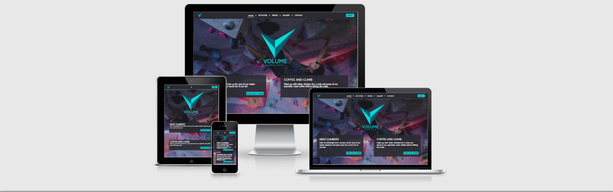

 
## UX Design 
 
### Project Goals
 
Volume has decided to build this website in order to encourage greater traffic to their new Birmingham centre. This website will help facilitate this in a number of ways including:
* Providing an easy way for existing members to find and book times/dates for their climbing sessions.
* Building Volumes overall sense of brand identity. 
* Promoting a greater online presence and generating greater ‘natural traffic’. 
* Encouraging repeat custom by providing a sense of community centered on their service.
* Promoting climbing as a fun and social sport to potential new climbers.
* Making it easy to find details on all services they can provide to both prospective and existing customers.
* Providing a way to easily locate and contact the centre.
 
### User Stories
 
#### First time user (non climber)  - As a first time visitor with no previous climbing experience...
* I want the site navigation to be simple and intuitive. It should be easy to find the content relevant to me. 
* I want to easily understand the purpose of the site and the company behind it.
* I want to understand what this organisation offers and why I should be using them over their competitors. 
* I want to learn about the sport of climbing itself. I would like to know whether this is the right choice for me and understand what it would take to get started.
 
#### First time user (experienced climber) - As a first time visitor with previous climbing experience…
* I want the site navigation to be simple and intuitive. It should be easy to find the content relevant to me.
* I want to understand the services being offered by the centre and whether they match my needs. 
* I want to easily be able to find information relevant to visiting the centre such as location and cost. 
* I want to be able to easily book a time and date for my next climbing session.  
 
#### Returning/Frequent user (experienced climber) - As a Returning/Frequent user with previous climbing experience…
* I want to be able to easily book a time for my next climbing session.
* I want to check if there are any upcoming social events such as climbing competitions or meetups.
* I want to check if there are any changes to procedure such as opening times or pricing.  
 
### Structure
The website is made up of six pages in total, separated by functionality. This was done with the aim to make any specific information a user might be looking for easily accessible within a small number of clicks and to keep the amount of info per page to a minimum to avoid overwhelming users.
 
### Wireframes
 
Each wireframe contains designs for desktop, tablet and mobile devices.
 
 * [Home](assets/images/readme-images/Wireframes/Home.png)
 * [Activities](assets/images/readme-images/Wireframes/Activities.png)
 * [Prices](assets/images/readme-images/Wireframes/Prices.png)
 * [Gallery](assets/images/readme-images/Wireframes/Gallery.png)
 * [Contact](assets/images/readme-images/Wireframes/Contact.png)
 * [Booking](assets/images/readme-images/Wireframes/Booking.png)
 
 ### Responsive design
 
 This site was designed using a 12 column grid layout and displays content responsive based on the users screen size. The site also makes use of smaller resolution images on smaller screens to reduce required bandwidth on mobile devices. 
 
### Colour Scheme
 
The colour scheme I chose for this site is simple but bold. The main, three colour scheme (pictured left to right below) consists of an off black and white colours and a vibrant blue to act as an action colour. The final two colours are pale shades, colour picked from the hero image used on the home page. These colours are used in a linear gradient for the background of the informational pages. This palette gives high contrast without being too aggressive and the limited colour palette helps create a uniform look across all pages. Background images were also dimmed using an opaque gradient of the same off black colour to maintain contrast between background and foreground elements.
 

    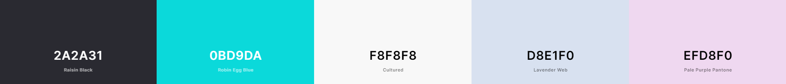

 
## Features 
 
### Existing Features 
 
* Navigation bar
    * The navigation bar is a primary feature of all six pages, it is full width and has a fixed position at the top of the page. This element will allow the user to navigate the site easily without using browser controls and promotes user conversion by prominently displaying the booking button at all times. 

    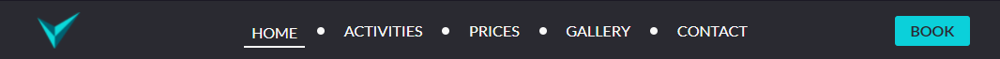

 
 * On mobile and tablet devices the page navigation links, excluding the booking page link, collapse into a hamburger icon which can be clicked to reveal a full page, vertically oriented, list of navigation links. 

    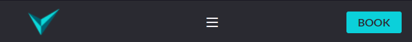

    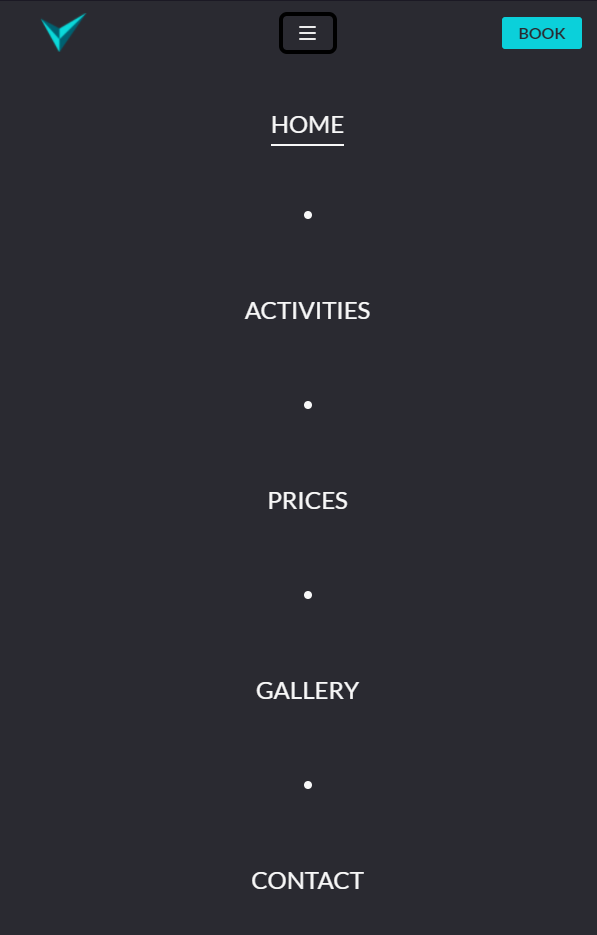

 
* For ease of access, the Volume logo (home button) and the link to the booking page do not collapse into the hamburger icon and are therefor always within easy reach of the user. 
 
 * Footer
    * The footer section is consistent across all pages and contains centre opening hours, basic company contact information, site navigation and social media links. This element is valuable to the user as it provides a consistent, site-wide way of accessing the most common information they may be looking for. It also promotes further browsing through use of site navigation links and externally opening social media links. 

    

 
 * Error 404 page
    * If the user requests a page that does not exist they will instead come to the 404.html page. Here, they will be prompted to return to the sites home page.

    

 
#### Home page
 
 * Intro/Hero image
    * This section contains a hero image, displaying a person climbing. This image helps quickly convey the site's topic to a new user and helps promote it in a fun and exciting light. Also prominently displayed is the brand logo helping to build brand identity as well short info cards which can help direct users to more detailed information depending on their needs. 

    

 
 * About us
    * The about us section provides a short explanation of the company's ethos and origin. This information combined with a picture of the team hopes to build a sense of familiarity and promote the company's social, friendly and approachable nature. 

    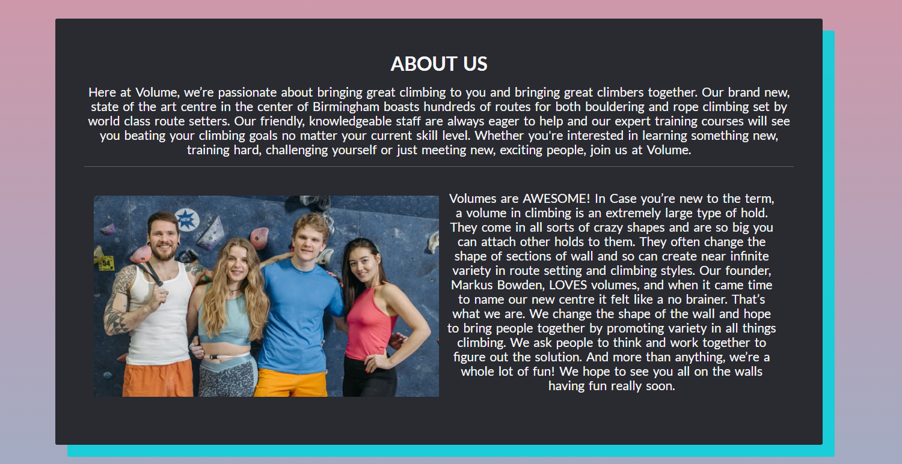

 
 * News 
    * This section contains informational cards giving details for current or upcoming events and activities. This further promotes the centre's socially driven nature and is a simple way for returning users to check in on updates and events.

    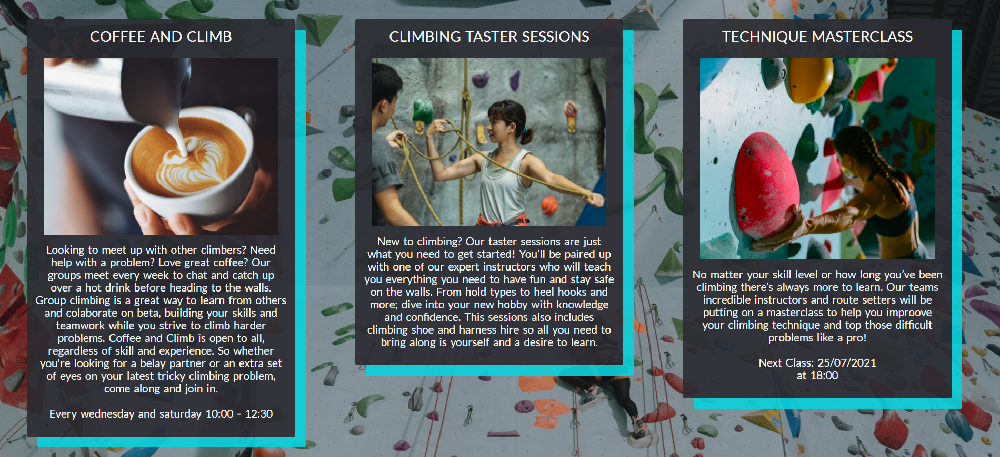

 
#### Activities page
 
 * Activity breakdown 
    * As part of the activities page, each available activity offered by 'Volume' is presented with a short breakdown of what it entails and an image as demonstration. This is ideal for users who may be new to the sport as it will help them understand what different disciplines are and help them to make decisions about the offered services. 

    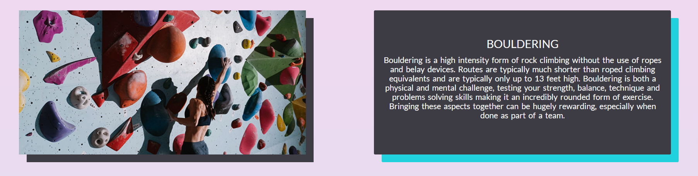

 
#### Prices page
 
 * Pricing tables
    * The prices page contains costs for all offered services as well as for registration, equipment hire and membership. This is key information for any user considering booking a session and having it easily available and clearly displayed removes potential barriers that might hinder a user from making a booking.  

    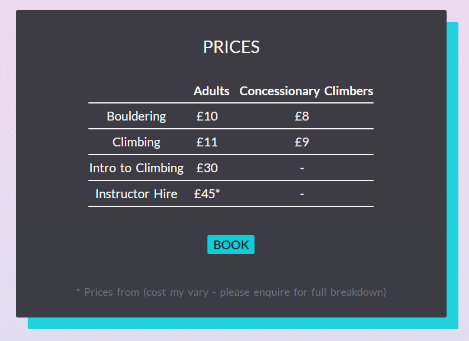

 
#### Gallery page
 
 * Image gallery
    * The gallery page contains images from the centre and it's climbers. This gallery helps to further promote the brand's social disposition, showing the fun and interactive nature of the centre and sport. This will help encourage bookings from both new and returning customers. 

    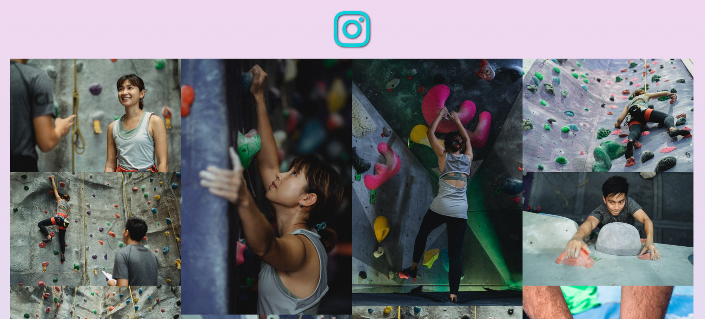

 
#### Contact page
 
 * Contact information and form
    * The contact section consists of a direct contact form allowing users to ask questions or give feedback through the website as well as more traditional forms of contact info (phone, email, address) and links to the organisations social media accounts.   

    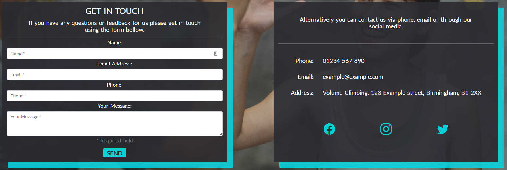

 
#### Booking page 
 
 * Online booking form
    * The booking page contains a form which allows the user to book a time and date for one of the centre's activities. Users will be asked to submit their name, email address and phone number and can select the type of activity they wish to book.

    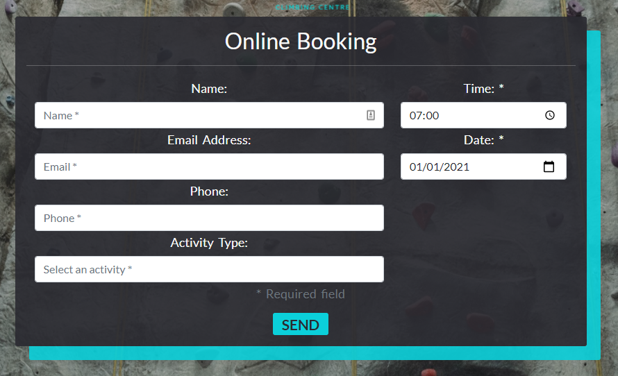

 
### Potential future features
 
 * Social media integration 
    * Generate news cards for the home page from facebook or twitter posts.
    * Generate images for gallery the page from instagram. 
 * Database integration
    * Save user details for future bookings. 
 
## Testing 
 
To test site performance I used Google Chrome's Lighthouse tools. I tested all pages for both desktop and mobile performance and all scored above 90.

    

 
### Code validation
 
All custom CSS was tested using [W3C Validator](https://jigsaw.w3.org/css-validator/#validate_by_input) and returned no errors.

    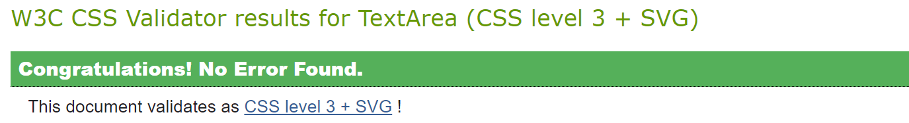

All HTML was tested using [Nu Html Checker](https://validator.w3.org/nu) and returned no errors or warnings.

    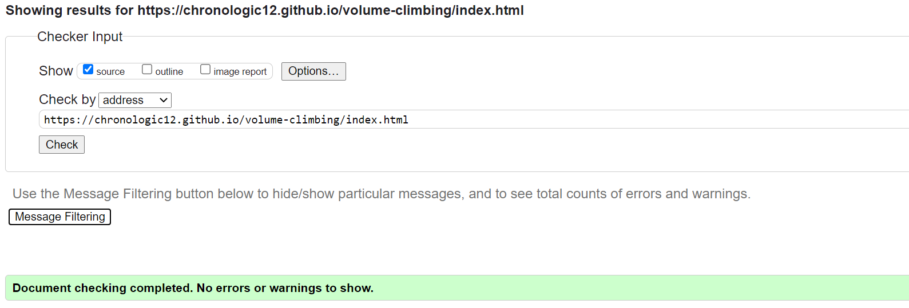

 
## Deployment - GitHub Pages
 
The site was deployed through GitHub Pages using the following steps.
* Navigate to the GitHub repository and select the Settings tab
* Select the Pages section
* Use the dropdown menu in the source section to select the Master Branch. Click save.
* Once the branch has been selected the page will update displaying: "Your site is published at (https://chronologic12.github.io/volume-climbing/)"
 
## Credits 
### Content 
* [Bootstrap](https://getbootstrap.com/) was used to create the collapsing navigation bar and responsive grid layouts 
* [Bootstrap Icons](https://icons.getbootstrap.com/) for social media link icons
* [Fancybox](https://fancyapps.com/docs/ui/fancybox/) was used to create interactive images and the image gallery 
* [Google maps](https://www.google.com/maps/) The code for the map element of the contact page was created by google maps.
* [Google-webfonts-helper](https://google-webfonts-helper.herokuapp.com/fonts) generated the css for using fonts locally 
* [Github docs](https://docs.github.com/en/pages/getting-started-with-github-pages/creating-a-custom-404-page-for-your-github-pages-site) This guide was used to create the error 404 page.
 
 
### Media
 
 * All images were sourced from [Pexels](https://www.pexels.com/) and can be found in [this collection](https://www.pexels.com/collections/volume-rmvjg5w/).
 
 * [Cloudinary](https://cloudinary.com/console/c-087b7b36d5737750ed37ab5fb60479/getting-started) CDN was use to store and deliver images to the site in multiple resolutions and improve performance. 
 
 * The brand logo was created by me, using [Adobe Photoshop](https://www.adobe.com/uk/products/photoshop.html?mv=search&mv=search&sdid=LZ32SYVR&ef_id=Cj0KCQjw8vqGBhC_ARIsADMSd1ABTiJnO8LkQCgsmMmARI5EC_QqrkMEL3OGW7HCihtdXmiVUZtmQAAaAqYlEALw_wcB:G:s&s_kwcid=AL!3085!3!520876516720!e!!g!!adobe%20photoshop!1422700211!58647953511&gclid=Cj0KCQjw8vqGBhC_ARIsADMSd1ABTiJnO8LkQCgsmMmARI5EC_QqrkMEL3OGW7HCihtdXmiVUZtmQAAaAqYlEALw_wcB) 
 
 * All text displayed on this site was written by me.
 
### Help and info
 
* Code Institute learning material - general knowledge.
* [Codecademy](https://www.codecademy.com/learn) - general knowledge.
* [w3schools](https://www.w3schools.com/) - general knowledge.
* [MND Web Docs](https://developer.mozilla.org/en-US/) - general knowledge.
* [Stack Overflow](https://stackoverflow.com/) - debugging. 